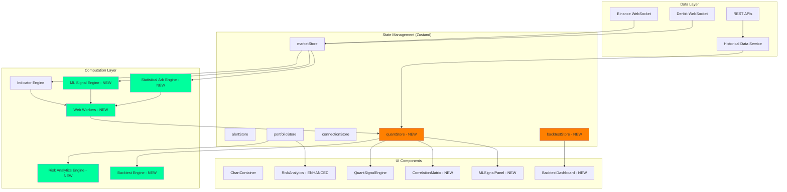

# Design Document

## Overview

This design document outlines the architecture and implementation approach for enhancing the quant.term cryptocurrency trading terminal with advanced quantitative features. The enhancements will build upon the existing React 19 + TypeScript + Zustand architecture while introducing new quantitative analysis capabilities including statistical arbitrage detection, machine learning signal generation, comprehensive risk analytics, and a full backtesting engine.

The design maintains the existing low-latency requirements (<50ms tick-to-chart) and follows the established patterns of WebSocket services, Zustand stores, and React components with error boundaries. All new features will be implemented as modular components that can be independently developed and tested.

## Architecture

### High-Level System Architecture



### Technology Stack Additions

| Technology | Purpose | Justification |
|------------|---------|---------------|
| **TensorFlow.js** | ML model training and inference | Browser-based ML without backend, 60fps inference |
| **Web Workers** | Offload heavy computations | Prevent main thread blocking during indicator calculations |
| **IndexedDB (idb-keyval)** | Store historical data locally | Fast access to backtesting data, reduce API calls |
| **jsPDF** | Generate PDF reports | Export performance reports for offline analysis |
| **papaparse** | CSV export/import | Data export for external analysis tools |

## Components and Interfaces

### 1. New Zustand Stores

#### quantStore.ts

Manages quantitative analysis state including correlations, statistical arbitrage signals, and ML predictions.

```typescript
interface QuantState {
  // Correlation data
  correlationMatrix: Map<string, Map<string, number>>;
  correlationLastUpdate: number;
  
  // Statistical arbitrage
  statArbSignals: StatArbSignal[];
  pairSpreads: Map<string, SpreadData>;
  
  // ML predictions
  mlPredictions: Map<string, MLPrediction>;
  mlModelMetrics: ModelMetrics;
  mlLastTraining: number;
  
  // Multi-timeframe data
  multiTimeframeData: Map<string, TimeframeData>;
  
  // Actions
  updateCorrelation: (pair: string, correlation: number) => void;
  addStatArbSignal: (signal: StatArbSignal) => void;
  updateMLPrediction: (symbol: string, prediction: MLPrediction) => void;
  setMLModelMetrics: (metrics: ModelMetrics) => void;
  updateMultiTimeframe: (symbol: string, data: TimeframeData) => void;
}

interface StatArbSignal {
  pair: [string, string];
  correlation: number;
  zScore: number;
  spread: number;
  signal: 'LONG_A_SHORT_B' | 'SHORT_A_LONG_B' | 'NEUTRAL';
  confidence: number;
  timestamp: number;
}

interface MLPrediction {
  symbol: string;
  direction: 'UP' | 'DOWN' | 'NEUTRAL';
  confidence: number;
  horizon: '15m' | '1h' | '4h';
  features: Record<string, number>;
  featureImportance: Record<string, number>;
  timestamp: number;
}

interface TimeframeData {
  '5m': IndicatorSet;
  '15m': IndicatorSet;
  '1h': IndicatorSet;
  '4h': IndicatorSet;
}
```

#### backtestStore.ts

Manages backtesting state including strategy configuration, execution, and results.

```typescript
interface BacktestState {
  // Strategy configuration
  strategy: StrategyConfig | null;
  
  // Execution state
  isRunning: boolean;
  progress: number;
  
  // Results
  results: BacktestResults | null;
  trades: Trade[];
  equityCurve: EquityPoint[];
  
  // Historical data cache
  historicalData: Map<string, OHLCV[]>;
  
  // Actions
  setStrategy: (strategy: StrategyConfig) => void;
  runBacktest: () => Promise<void>;
  stopBacktest: () => void;
  clearResults: () => void;
  loadHistoricalData: (symbol: string, start: number, end: number) => Promise<void>;
}

interface StrategyConfig {
  name: string;
  symbol: string;
  timeframe: string;
  startDate: number;
  endDate: number;
  initialCapital: number;
  positionSize: number;
  
  // Entry rules
  entryRules: Rule[];
  
  // Exit rules
  exitRules: Rule[];
  
  // Risk management
  stopLoss?: number;
  takeProfit?: number;
  maxPositions: number;
}

interface Rule {
  type: 'INDICATOR' | 'PRICE' | 'TIME';
  indicator?: string;
  condition: 'ABOVE' | 'BELOW' | 'CROSSES_ABOVE' | 'CROSSES_BELOW' | 'EQUALS';
  value: number;
  logic: 'AND' | 'OR';
}

interface BacktestResults {
  totalReturn: number;
  sharpeRatio: number;
  maxDrawdown: number;
  winRate: number;
  profitFactor: number;
  totalTrades: number;
  avgWin: number;
  avgLoss: number;
  largestWin: number;
  largestLoss: number;
  avgHoldingPeriod: number;
}
```

### 2. New Services

#### historicalDataService.ts

Fetches and caches historical OHLCV data for backtesting and analysis.

```typescript
class HistoricalDataService {
  private cache: Map<string, OHLCV[]> = new Map();
  private db: IDBKeyVal;
  
  /**
   * Fetch historical data from Binance API
   * Implements pagination for large date ranges
   */
  async fetchHistoricalData(
    symbol: string,
    interval: string,
    startTime: number,
    endTime: number
  ): Promise<OHLCV[]>;
  
  /**
   * Cache data in IndexedDB for offline access
   */
  async cacheData(symbol: string, interval: string, data: OHLCV[]): Promise<void>;
  
  /**
   * Retrieve cached data from IndexedDB
   */
  async getCachedData(symbol: string, interval: string): Promise<OHLCV[] | null>;
  
  /**
   * Clear old cached data (older than 30 days)
   */
  async clearOldCache(): Promise<void>;
}
```

#### mlService.ts

Handles machine learning model training, inference, and feature engineering.

```typescript
class MLService {
  private model: tf.LayersModel | null = null;
  private scaler: StandardScaler;
  private isTraining: boolean = false;
  
  /**
   * Extract features from market data
   * Features: RSI, MACD, BB position, volume ratio, OFI, funding rate
   */
  extractFeatures(data: OHLCV[], additionalData: MarketData): number[];
  
  /**
   * Train gradient boosting model
   * Uses last 7 days of data with 15-minute forward returns as labels
   */
  async trainModel(trainingData: TrainingData[]): Promise<ModelMetrics>;
  
  /**
   * Make prediction for current market state
   */
  async predict(features: number[]): Promise<MLPrediction>;
  
  /**
   * Calculate feature importance using permutation importance
   */
  calculateFeatureImportance(testData: TrainingData[]): Record<string, number>;
  
  /**
   * Save model to IndexedDB
   */
  async saveModel(): Promise<void>;
  
  /**
   * Load model from IndexedDB
   */
  async loadModel(): Promise<boolean>;
}
```

### 3. New Computation Engines

#### statisticalArbEngine.ts

Detects mean-reversion opportunities in correlated asset pairs.

```typescript
class StatisticalArbEngine {
  private correlationWindow: number = 30 * 24 * 60; // 30 days in minutes
  private zScoreThreshold: number = 2.0;
  
  /**
   * Calculate rolling correlation between two assets
   * Uses Pearson correlation coefficient
   */
  calculateCorrelation(
    pricesA: number[],
    pricesB: number[],
    window: number
  ): number;
  
  /**
   * Calculate z-score of price spread
   * Z-score = (current_spread - mean_spread) / std_spread
   */
  calculateSpreadZScore(
    pricesA: number[],
    pricesB: number[],
    window: number
  ): number;
  
  /**
   * Generate statistical arbitrage signals
   * Returns signals when z-score exceeds threshold
   */
  generateSignals(
    symbols: string[],
    marketData: Map<string, OHLCV[]>
  ): StatArbSignal[];
  
  /**
   * Calculate correlation matrix for all pairs
   */
  calculateCorrelationMatrix(
    symbols: string[],
    marketData: Map<string, OHLCV[]>
  ): Map<string, Map<string, number>>;
}
```

#### riskAnalyticsEngine.ts

Calculates comprehensive risk metrics for portfolio positions.

```typescript
class RiskAnalyticsEngine {
  /**
   * Calculate Historical Value at Risk (VaR)
   * Uses historical simulation method with 30-day rolling window
   */
  calculateVaR(
    returns: number[],
    confidenceLevel: number = 0.95
  ): number;
  
  /**
   * Calculate Conditional Value at Risk (CVaR)
   * Expected loss beyond VaR threshold
   */
  calculateCVaR(
    returns: number[],
    confidenceLevel: number = 0.95
  ): number;
  
  /**
   * Calculate Sharpe Ratio
   * (Mean Return - Risk Free Rate) / Std Dev of Returns
   * Assumes 0% risk-free rate for crypto
   */
  calculateSharpeRatio(
    returns: number[],
    window: number = 30
  ): number;
  
  /**
   * Calculate Maximum Drawdown
   * Largest peak-to-trough decline
   */
  calculateMaxDrawdown(equityCurve: number[]): {
    maxDrawdown: number;
    currentDrawdown: number;
    peakValue: number;
    troughValue: number;
  };
  
  /**
   * Calculate portfolio beta relative to BTC
   */
  calculateBeta(
    portfolioReturns: number[],
    marketReturns: number[]
  ): number;
}
```

#### backtestEngine.ts

Simulates trading strategies against historical data.

```typescript
class BacktestEngine {
  private strategy: StrategyConfig;
  private data: OHLCV[];
  private positions: Position[] = [];
  private trades: Trade[] = [];
  private equity: number;
  
  /**
   * Run backtest simulation
   * Iterates through historical data and executes strategy rules
   */
  async run(): Promise<BacktestResults>;
  
  /**
   * Evaluate entry rules at current candle
   */
  private evaluateEntryRules(candle: OHLCV, indicators: IndicatorSet): boolean;
  
  /**
   * Evaluate exit rules at current candle
   */
  private evaluateExitRules(candle: OHLCV, indicators: IndicatorSet): boolean;
  
  /**
   * Execute trade with slippage and fees
   */
  private executeTrade(
    type: 'LONG' | 'SHORT',
    price: number,
    size: number
  ): Trade;
  
  /**
   * Calculate performance metrics from trade history
   */
  private calculateMetrics(): BacktestResults;
  
  /**
   * Generate equity curve
   */
  private generateEquityCurve(): EquityPoint[];
}
```

### 4. Web Worker Implementation

#### quantWorker.ts

Offloads heavy computations to prevent main thread blocking.

```typescript
// Web Worker for quantitative calculations
self.onmessage = async (e: MessageEvent) => {
  const { type, payload } = e.data;
  
  switch (type) {
    case 'CALCULATE_INDICATORS':
      const indicators = calculateAllIndicators(payload.data);
      self.postMessage({ type: 'INDICATORS_RESULT', payload: indicators });
      break;
      
    case 'CALCULATE_CORRELATION':
      const correlation = calculateCorrelationMatrix(payload.symbols, payload.data);
      self.postMessage({ type: 'CORRELATION_RESULT', payload: correlation });
      break;
      
    case 'RUN_BACKTEST':
      const results = await runBacktest(payload.strategy, payload.data);
      self.postMessage({ type: 'BACKTEST_RESULT', payload: results });
      break;
      
    case 'ML_PREDICT':
      const prediction = await mlPredict(payload.features);
      self.postMessage({ type: 'ML_PREDICTION', payload: prediction });
      break;
  }
};
```

### 5. New React Components

#### CorrelationMatrix.jsx

Displays heatmap of asset correlations with interactive selection.

```typescript
interface CorrelationMatrixProps {
  symbols: string[];
  onPairSelect?: (symbolA: string, symbolB: string) => void;
}

// Features:
// - Color-coded heatmap (red = negative, green = positive)
// - Click to view pair spread chart
// - Highlight pairs with correlation > 0.7
// - Update every 60 seconds
```

#### MLSignalPanel.jsx

Displays ML model predictions with confidence scores and feature importance.

```typescript
interface MLSignalPanelProps {
  symbol: string;
}

// Features:
// - Direction prediction (UP/DOWN/NEUTRAL)
// - Confidence percentage
// - Feature importance bar chart
// - Model performance metrics (accuracy, precision, recall)
// - Last training timestamp
```

#### BacktestDashboard.jsx

Comprehensive backtesting interface with strategy builder and results visualization.

```typescript
interface BacktestDashboardProps {
  onStrategyRun?: (results: BacktestResults) => void;
}

// Features:
// - Strategy builder with drag-and-drop rules
// - Date range selector
// - Real-time progress bar during execution
// - Equity curve chart
// - Drawdown chart
// - Trade distribution histogram
// - Performance metrics table
// - Export results to CSV/PDF
```

#### MultiTimeframePanel.jsx

Shows indicator values across multiple timeframes with confluence detection.

```typescript
interface MultiTimeframePanelProps {
  symbol: string;
  timeframes: string[];
}

// Features:
// - Grid layout showing RSI/MACD/EMA for each timeframe
// - Color-coded bullish/bearish indicators
// - Confluence score when multiple timeframes align
// - Highlight when RSI crosses thresholds on multiple timeframes
```

## Data Models

### Core Data Types

```typescript
// Extended OHLCV with additional fields
interface ExtendedOHLCV extends OHLCV {
  indicators?: {
    rsi?: number;
    macd?: MACDValue;
    bb?: BollingerBandsValue;
    atr?: number;
    vwap?: number;
  };
  orderFlow?: {
    buyVolume: number;
    sellVolume: number;
    imbalance: number;
  };
}

// Trade execution record
interface Trade {
  id: string;
  symbol: string;
  type: 'LONG' | 'SHORT';
  entryPrice: number;
  exitPrice: number;
  size: number;
  entryTime: number;
  exitTime: number;
  pnl: number;
  pnlPercent: number;
  fees: number;
  reason: string; // Entry/exit reason
}

// Position tracking
interface Position {
  symbol: string;
  type: 'LONG' | 'SHORT';
  entryPrice: number;
  size: number;
  currentPrice: number;
  unrealizedPnl: number;
  openTime: number;
}

// Equity curve point
interface EquityPoint {
  time: number;
  equity: number;
  drawdown: number;
}

// Standard scaler for ML feature normalization
interface StandardScaler {
  mean: number[];
  std: number[];
  fit: (data: number[][]) => void;
  transform: (data: number[][]) => number[][];
}
```

## Error Handling

### Error Boundary Strategy

Each new panel will be wrapped in `PanelErrorBoundary` to prevent cascading failures:

```typescript
<PanelErrorBoundary panelName="ML Signal Engine">
  <MLSignalPanel symbol={selectedSymbol} />
</PanelErrorBoundary>
```

### Computation Error Handling

```typescript
// Web Worker error handling
try {
  const result = await workerPool.execute('CALCULATE_INDICATORS', data);
  quantStore.getState().updateIndicators(result);
} catch (error) {
  console.error('[QuantWorker] Calculation failed:', error);
  toast.error('Indicator calculation failed. Using cached values.');
  // Fallback to last known good values
}

// ML prediction error handling
try {
  const prediction = await mlService.predict(features);
  quantStore.getState().updateMLPrediction(symbol, prediction);
} catch (error) {
  console.error('[ML] Prediction failed:', error);
  // Return neutral prediction with low confidence
  return {
    direction: 'NEUTRAL',
    confidence: 0,
    timestamp: Date.now()
  };
}
```

### Data Validation

```typescript
// Validate historical data before backtesting
function validateBacktestData(data: OHLCV[]): ValidationResult {
  const errors: string[] = [];
  
  if (data.length < 100) {
    errors.push('Insufficient data: need at least 100 candles');
  }
  
  // Check for gaps in data
  for (let i = 1; i < data.length; i++) {
    const timeDiff = data[i].time - data[i-1].time;
    if (timeDiff > expectedInterval * 2) {
      errors.push(`Data gap detected at ${new Date(data[i].time * 1000)}`);
    }
  }
  
  // Check for invalid prices
  const invalidPrices = data.filter(d => 
    d.close <= 0 || !isFinite(d.close) || isNaN(d.close)
  );
  
  if (invalidPrices.length > 0) {
    errors.push(`Found ${invalidPrices.length} candles with invalid prices`);
  }
  
  return {
    isValid: errors.length === 0,
    errors
  };
}
```

## Testing Strategy

### Unit Tests

```typescript
// Test indicator calculations
describe('Statistical Arbitrage Engine', () => {
  it('should calculate correlation correctly', () => {
    const pricesA = [100, 102, 101, 103, 105];
    const pricesB = [50, 51, 50.5, 51.5, 52.5];
    const correlation = statArbEngine.calculateCorrelation(pricesA, pricesB, 5);
    expect(correlation).toBeCloseTo(0.99, 2);
  });
  
  it('should generate signal when z-score exceeds threshold', () => {
    const signals = statArbEngine.generateSignals(['BTCUSDT', 'ETHUSDT'], mockData);
    expect(signals.length).toBeGreaterThan(0);
    expect(signals[0].zScore).toBeGreaterThan(2.0);
  });
});

// Test backtest engine
describe('Backtest Engine', () => {
  it('should execute trades according to strategy rules', async () => {
    const strategy: StrategyConfig = {
      name: 'RSI Mean Reversion',
      entryRules: [{ type: 'INDICATOR', indicator: 'RSI', condition: 'BELOW', value: 30 }],
      exitRules: [{ type: 'INDICATOR', indicator: 'RSI', condition: 'ABOVE', value: 70 }]
    };
    
    const results = await backtestEngine.run(strategy, mockHistoricalData);
    expect(results.totalTrades).toBeGreaterThan(0);
    expect(results.sharpeRatio).toBeDefined();
  });
  
  it('should account for trading fees', async () => {
    const results = await backtestEngine.run(strategy, mockData);
    const totalFees = results.trades.reduce((sum, t) => sum + t.fees, 0);
    expect(totalFees).toBeGreaterThan(0);
  });
});

// Test ML service
describe('ML Service', () => {
  it('should extract features correctly', () => {
    const features = mlService.extractFeatures(mockOHLCV, mockMarketData);
    expect(features.length).toBe(6); // RSI, MACD, BB, volume, OFI, funding
    expect(features.every(f => isFinite(f))).toBe(true);
  });
  
  it('should make predictions with confidence scores', async () => {
    await mlService.trainModel(mockTrainingData);
    const prediction = await mlService.predict(mockFeatures);
    expect(prediction.confidence).toBeGreaterThanOrEqual(0);
    expect(prediction.confidence).toBeLessThanOrEqual(1);
  });
});
```

### Integration Tests

```typescript
// Test Web Worker communication
describe('Quant Worker Integration', () => {
  it('should calculate indicators in worker thread', async () => {
    const result = await workerPool.execute('CALCULATE_INDICATORS', mockData);
    expect(result.rsi).toBeDefined();
    expect(result.macd).toBeDefined();
  });
  
  it('should handle worker errors gracefully', async () => {
    const invalidData = null;
    await expect(
      workerPool.execute('CALCULATE_INDICATORS', invalidData)
    ).rejects.toThrow();
  });
});

// Test store integration
describe('Quant Store Integration', () => {
  it('should update correlation matrix', () => {
    const { updateCorrelation, correlationMatrix } = useQuantStore.getState();
    updateCorrelation('BTCUSDT-ETHUSDT', 0.85);
    expect(correlationMatrix.get('BTCUSDT')?.get('ETHUSDT')).toBe(0.85);
  });
});
```

### Performance Tests

```typescript
// Test computation performance
describe('Performance Benchmarks', () => {
  it('should calculate 1000 RSI values in < 100ms', () => {
    const start = performance.now();
    const rsi = calculateRSI(largeDataset, 14);
    const duration = performance.now() - start;
    expect(duration).toBeLessThan(100);
  });
  
  it('should run backtest on 10k candles in < 5s', async () => {
    const start = performance.now();
    await backtestEngine.run(strategy, tenThousandCandles);
    const duration = performance.now() - start;
    expect(duration).toBeLessThan(5000);
  });
});
```

## Performance Optimization

### Web Worker Pool

```typescript
class WorkerPool {
  private workers: Worker[] = [];
  private queue: Task[] = [];
  private maxWorkers: number = navigator.hardwareConcurrency || 4;
  
  constructor() {
    // Initialize worker pool
    for (let i = 0; i < this.maxWorkers; i++) {
      this.workers.push(new Worker('/workers/quantWorker.js'));
    }
  }
  
  async execute(type: string, payload: any): Promise<any> {
    return new Promise((resolve, reject) => {
      const worker = this.getAvailableWorker();
      
      const timeout = setTimeout(() => {
        reject(new Error('Worker timeout'));
      }, 30000); // 30s timeout
      
      worker.onmessage = (e) => {
        clearTimeout(timeout);
        resolve(e.data.payload);
      };
      
      worker.onerror = (error) => {
        clearTimeout(timeout);
        reject(error);
      };
      
      worker.postMessage({ type, payload });
    });
  }
  
  private getAvailableWorker(): Worker {
    // Round-robin worker selection
    return this.workers[this.queue.length % this.workers.length];
  }
}
```

### Data Caching Strategy

```typescript
// Cache indicator calculations to avoid recomputation
class IndicatorCache {
  private cache: Map<string, CacheEntry> = new Map();
  private maxAge: number = 60000; // 1 minute
  
  get(key: string): any | null {
    const entry = this.cache.get(key);
    if (!entry) return null;
    
    if (Date.now() - entry.timestamp > this.maxAge) {
      this.cache.delete(key);
      return null;
    }
    
    return entry.value;
  }
  
  set(key: string, value: any): void {
    this.cache.set(key, {
      value,
      timestamp: Date.now()
    });
    
    // Limit cache size
    if (this.cache.size > 100) {
      const oldestKey = Array.from(this.cache.keys())[0];
      this.cache.delete(oldestKey);
    }
  }
}
```

### Lazy Loading

```typescript
// Lazy load heavy components
const BacktestDashboard = React.lazy(() => import('@/components/BacktestDashboard'));
const CorrelationMatrix = React.lazy(() => import('@/components/CorrelationMatrix'));
const MLSignalPanel = React.lazy(() => import('@/components/MLSignalPanel'));

// Use with Suspense
<Suspense fallback={<LoadingSpinner />}>
  <BacktestDashboard />
</Suspense>
```

## Security Considerations

### Data Validation

- Validate all user inputs for strategy configuration
- Sanitize symbol names to prevent injection attacks
- Limit backtest date ranges to prevent excessive API calls
- Validate ML model inputs to prevent adversarial attacks

### Rate Limiting

- Respect Binance API rate limits (1200 requests/minute)
- Implement exponential backoff for failed requests
- Cache historical data to minimize API calls
- Batch multiple symbol requests when possible

### Client-Side Security

- No sensitive data stored in localStorage (only preferences)
- ML models stored in IndexedDB with encryption
- No external script loading (all dependencies bundled)
- Content Security Policy headers in production

## Deployment Considerations

### Bundle Size Optimization

```typescript
// Code splitting by route
const routes = [
  {
    path: '/backtest',
    component: React.lazy(() => import('@/pages/BacktestPage'))
  },
  {
    path: '/ml-signals',
    component: React.lazy(() => import('@/pages/MLSignalsPage'))
  }
];

// Tree-shaking unused TensorFlow.js operations
import * as tf from '@tensorflow/tfjs-core';
import '@tensorflow/tfjs-backend-webgl';
// Only import required operations
```

### Progressive Enhancement

- Core trading features work without ML (graceful degradation)
- Backtest engine works offline with cached data
- Correlation matrix updates even if some symbols fail to load
- Alert system continues working if ML predictions fail

### Browser Compatibility

- Target: Chrome 120+, Firefox 121+, Safari 17+, Edge 120+
- Polyfills for Web Workers in older browsers
- Fallback to main thread if Web Workers unavailable
- IndexedDB fallback to localStorage if unavailable

## Migration Path

### Phase 1: Core Infrastructure (Week 1)
1. Create new Zustand stores (quantStore, backtestStore)
2. Implement Web Worker pool
3. Create historicalDataService
4. Set up IndexedDB caching

### Phase 2: Statistical Analysis (Week 2)
1. Implement statisticalArbEngine
2. Create CorrelationMatrix component
3. Add correlation calculations to existing QuantSignalEngine
4. Implement multi-timeframe data fetching

### Phase 3: ML Integration (Week 3)
1. Implement mlService with TensorFlow.js
2. Create MLSignalPanel component
3. Add feature extraction pipeline
4. Implement model training workflow

### Phase 4: Risk Analytics (Week 4)
1. Implement riskAnalyticsEngine
2. Enhance existing RiskAnalytics component
3. Add VaR/CVaR calculations
4. Implement drawdown tracking

### Phase 5: Backtesting (Week 5)
1. Implement backtestEngine
2. Create BacktestDashboard component
3. Add strategy builder UI
4. Implement results visualization

### Phase 6: Polish & Optimization (Week 6)
1. Performance optimization
2. Error handling improvements
3. Documentation
4. Testing and bug fixes

## Open Questions

1. **ML Model Architecture**: Should we use a simple feedforward network or LSTM for time series? (Recommendation: Start with feedforward for speed, add LSTM if needed)

2. **Correlation Update Frequency**: 60 seconds or real-time? (Recommendation: 60 seconds to balance accuracy and performance)

3. **Backtest Data Storage**: Store all historical data or fetch on-demand? (Recommendation: Cache last 90 days, fetch older data on-demand)

4. **Web Worker Count**: Fixed pool size or dynamic based on CPU cores? (Recommendation: Dynamic based on navigator.hardwareConcurrency)

5. **ML Training Schedule**: Manual trigger or automatic daily? (Recommendation: Automatic daily at low-traffic hours, with manual override)
