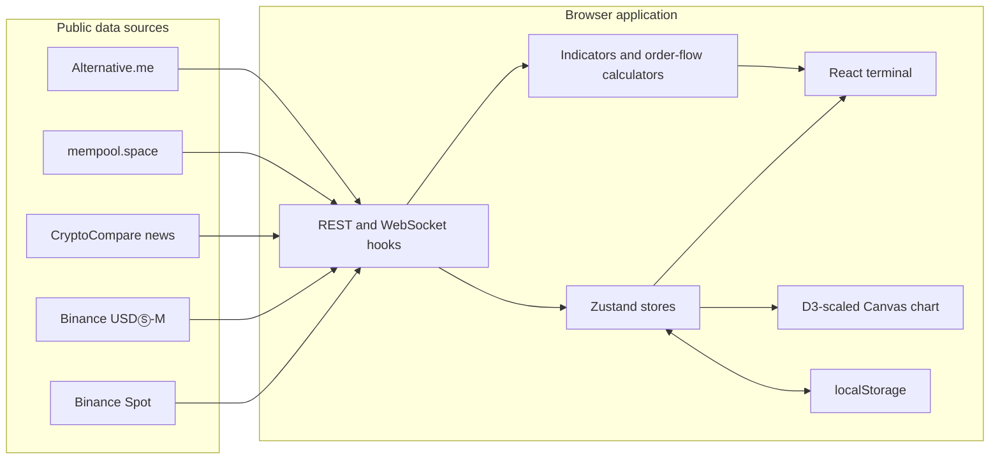
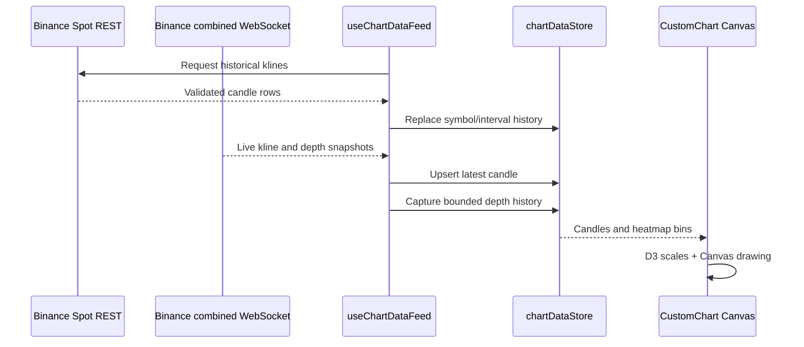

# quant.term architecture

## System overview

`quant.term` is a static, client-side React application. It reads public market and network endpoints directly from the browser, renders a desktop terminal, and stores user preferences, alerts, and paper-trading state locally. There is no application backend, authentication layer, or order-routing service.


```mermaid
flowchart LR
    subgraph Sources["Public data sources"]
        BS["Binance Spot"]
        BF["Binance USDⓈ-M"]
        CC["CryptoCompare news"]
        MP["mempool.space"]
        FG["Alternative.me"]
    end

    subgraph Browser["Browser application"]
        Feeds["REST and WebSocket hooks"]
        Stores["Zustand stores"]
        Calc["Indicators and order-flow calculators"]
        UI["React terminal"]
        Chart["D3-scaled Canvas chart"]
        Local["localStorage"]
    end

    BS --> Feeds
    BF --> Feeds
    CC --> Feeds
    MP --> Feeds
    FG --> Feeds
    Feeds --> Stores
    Feeds --> Calc
    Stores --> UI
    Calc --> UI
    Stores --> Chart
    Stores <--> Local
```

## Technology stack

| Layer | Technology | Current role |
|---|---|---|
| UI | React 19 | Component tree, effects, error boundaries, lazy panels |
| Language | TypeScript 5.9 | Strict application and financial-data types |
| Build | Vite 7 | Development server and static production bundle |
| State | Zustand 5 | Shared state, bounded buffers, selected persistence |
| Primary chart | Canvas + D3 7 | Price rendering, scales, axes, zoom, and pointer interaction |
| Layout | react-resizable-panels | Three-column resizable terminal workspace |
| Tests | Vitest + happy-dom | Unit and regression tests |

The installed Lightweight Charts package is not the primary dashboard renderer. The active price workspace uses `CustomChart.tsx` and Canvas.

## Runtime layout

```text
App
├── AppHeader
├── MarketOverviewBar
├── NewsTicker
├── resizable workspace
│   ├── Market Watch
│   │   └── MarketGrid
│   ├── Primary Market Workspace
│   │   ├── ChartContainer
│   │   │   └── CustomChart
│   │   └── Market Depth tabs
│   │       ├── OrderBookDOM
│   │       └── LiquidationFeed
│   └── Research and Intelligence
│       ├── QuantSignalEngine / AlphaPanel
│       └── Perpetuals / Paper / Network / Alerts / News
├── AppFooter
├── CommandPalette
└── KeyboardShortcutsModal
```

Global and per-panel error boundaries keep one failed data panel from replacing the entire workspace. `MobileGate` intentionally targets the full terminal at desktop layouts.

## Market-data paths

### Binance Spot

| Consumer | Transport | Data |
|---|---|---|
| `MarketGrid` | REST seed + `!ticker@arr` WebSocket | Last price, 24h change, volume |
| `useChartDataFeed` | REST klines | Historical candles, capped at Binance's request limit |
| `useBinanceWebSocket` | Combined WebSocket | Selected-symbol kline, trade, and top-20 depth snapshots |
| `OrderBookDOM` / OFI | Separate partial-depth WebSocket | Selected-symbol top-20 bids and asks |
| Volume delta / VPIN | Aggregate-trade WebSockets | Exchange taker-side volume classification |
| Research panels | REST klines | Heuristic indicators and factor calculations |

The active feed model is decentralized: panels own subscriptions appropriate to their update rate. Shared connection telemetry aggregates owner status so one unmounted subscriber does not incorrectly mark a healthy source offline.

### Binance USDⓈ-M Futures

- REST requests provide mark price, index price, funding rate, open interest, and the five-minute global long/short account ratio.
- The public `!forceOrder@arr` WebSocket supplies liquidation events, filtered for the selected symbol in the panel.

These feeds are market observations only. They do not use an account or submit orders.

### News and network data

- CryptoCompare supplies public English-language news. A 90-second in-memory cache and a shared in-flight request prevent duplicate refreshes.
- mempool.space supplies Bitcoin height, mempool statistics, and recommended fees.
- Alternative.me supplies the current Fear & Greed reading.

Requests use bounded timeouts and show unavailable states instead of generated fallback values.

## Chart pipeline


```mermaid
sequenceDiagram
    participant REST as Binance Spot REST
    participant WS as Binance combined WebSocket
    participant Feed as useChartDataFeed
    participant Store as chartDataStore
    participant Chart as CustomChart Canvas

    Feed->>REST: Request historical klines
    REST-->>Feed: Validated candle rows
    Feed->>Store: Replace symbol/interval history
    WS-->>Feed: Live kline and depth snapshots
    Feed->>Store: Upsert latest candle
    Feed->>Store: Capture bounded depth history
    Store-->>Chart: Candles and heatmap bins
    Chart->>Chart: D3 scales + Canvas drawing
```

If a live candle arrives while historical data is loading, the feed reapplies it after the REST response so history cannot roll the chart backward. The chart offers six intervals, optional EMA/RSI/MACD displays, and a derived depth heatmap.

## State and persistence

| Store/value | Responsibility | Persisted locally |
|---|---|---|
| `marketStore` | Selected symbol, watchlist, bounded shared market cache | Selected symbol and watchlist only |
| `chartDataStore` | Candle series metadata and heatmap configuration | No |
| `orderBookHistoryStore` | Bounded depth snapshots | No |
| `connectionStore` | Per-source status and measured message latency | No |
| `alertStore` | Alert definitions, triggers, session history | Definitions only; triggered flags reset on reload |
| `portfolioStore` | Simulated balance, positions, P&L, closed trades | Full paper state; closed trades capped at 250 |
| `quantStore` | Experimental ML/stat-arb metadata | Model metrics and last-training timestamp only |
| Theme | Dark/light preference | Yes |

Live exchange messages, news, Bitcoin network snapshots, alert history, and connection statistics are memory-only. Clearing site storage removes all persisted preferences, alerts, and paper activity.

## Alerts and paper trading

Price alerts run in the open browser against the selected symbol's live market price. Definitions can be enabled, disabled, or removed locally. Browser notifications require user permission; no remote notification service exists.

Paper trading is a local simulation:

- opening a position records the current public market price
- mark updates calculate unrealized P&L
- closing records realized P&L and a local trade-history row
- leverage is descriptive position metadata; no margin engine or liquidation model is applied
- no exchange key, wallet, or order endpoint is present

## Experimental analytics

OFI, volume delta/CVD, VPIN, Hurst, ADX, RSI, ATR, MACD, Bollinger Bands, OBV, VWAP, and composite scores are calculated in the browser from public data. The signal panel is explicitly heuristic.

Repository scaffolds for ML, econometrics, risk, options surfaces, stat-arbitrage, plugins, and multi-exchange adapters are not active product paths. Some are excluded from compilation or coverage until dependencies and data contracts are ready.

The active dashboard does not currently include authenticated on-chain analytics, an economic calendar, Deribit options, real VaR/Greeks, or automated execution.

## Reliability and telemetry

Active WebSocket hooks implement cleanup, stale-feed watchdogs, and bounded exponential reconnect delays. REST consumers use abort signals or refresh cycles appropriate to the panel. The footer derives latency from timestamps on actual selected-symbol exchange messages and reports update counts per second.

These are operational diagnostics, not an SLA. Network distance, browser scheduling, upstream throttling, regional access, and provider outages determine real latency and availability.

## Security and environment

The main dashboard requires no environment variables. All active providers expose public read-only endpoints.

Vite variables are compiled into browser JavaScript and must never hold private API keys. A future authenticated provider should be integrated through a separately secured backend or serverless proxy, not a `VITE_*` secret.

## Quality gates

CI installs from the lockfile, lints, type-checks, runs Vitest with configured coverage thresholds, and produces the Vite bundle. Financial calculations and state transitions have focused regression suites, including indicators, alerts, paper P&L, trade classification, and VPIN bucket overflow.

---

Last updated: 2026-07-17
