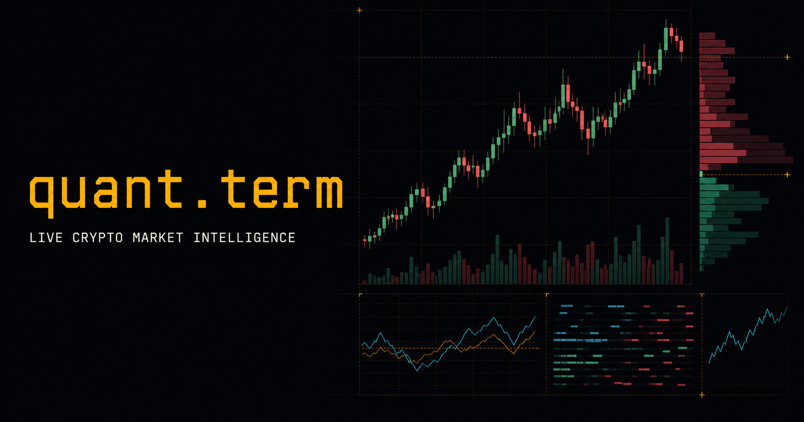

# quant.term

**A Bloomberg-inspired crypto market dashboard for live research, local alerts, and paper trading.**

**[Open the live terminal](https://quant-term.vercel.app)**

## Overview

`quant.term` is a read-only React terminal for monitoring public crypto-market data. Its primary workspace combines a custom D3-scaled Canvas chart with live Binance Spot candles, trades, and depth. Supporting panels cover Binance USDⓈ-M perpetual metrics, liquidations, public news, Bitcoin network conditions, browser-local alerts, and simulated positions.

No exchange credentials are accepted and no real orders are sent. Experimental analytics are research aids, not predictive models or financial advice.

## Highlights

- Live Binance Spot watchlist, candles, aggregate trades, and top-20 depth
- Custom Canvas chart with zoom/pan, EMA overlays, RSI, MACD, and depth heatmap
- Binance USDⓈ-M funding, mark/index price, open interest, positioning, and liquidations
- CoinDesk and Cointelegraph news through a cached same-origin edge route
- Bitcoin block, mempool, fee, and Fear & Greed snapshots
- Local price alerts with optional browser notifications
- Margin-aware simulated long/short positions with unrealized and realized P&L
- OFI, volume delta/CVD, VPIN, Hurst, ADX, ATR, RSI, MACD, OBV, and VWAP research panels
- Resizable desktop workspace, command palette, keyboard shortcuts, and themes

## Quick start

### Requirements

- Node.js 22.x (22.12 or newer)
- npm 10 or newer
- A current desktop browser

~~~bash
git clone https://github.com/JWHaan/quant.term.git
cd quant.term
npm ci
npm run dev
~~~

Open [http://localhost:3000](http://localhost:3000). The dashboard does not require an `.env` file.

### Quality checks

~~~bash
npm run check
~~~

| Command | Purpose |
|---|---|
| `npm run dev` | Start the local Vite/Worker development server |
| `npm run lint` | Run ESLint with zero warnings allowed |
| `npm run type-check` | Type-check the browser, Worker, Vercel adapter, and build config |
| `npm test` | Run the Vitest suite once |
| `npm run test:watch` | Run Vitest in watch mode |
| `npm run test:coverage` | Run tests and enforce the configured full-tree baseline |
| `npm run build` | Build and verify the Sites artifact |
| `npm run preview` | Preview the production client |
| `npm run check` | Run lint, type-check, tests, and build |

## Repository layout

~~~text
api/                         # Vercel Function adapters
build/                       # Build-time Sites integration
src/
├── app/                     # Application shell
├── features/                # Market, analytics, news, alert, and trading panels
├── hooks/                   # Live subscriptions and React orchestration
├── integrations/
│   ├── binance/             # Provider contracts, REST parsers, and liquidation feed
│   └── news/                # Browser news client
├── services/                # Shared telemetry and provenance services
├── stores/                  # Zustand application state
├── ui/                      # Reusable terminal UI
├── utils/                   # Indicators and market-microstructure calculations
└── tests/                   # Unit and regression tests
worker/                      # Sites/Cloudflare Worker and shared news handler
~~~

The browser talks directly to public market endpoints. The edge layer only normalizes public RSS news behind `/api/news`. See [ARCHITECTURE.md](ARCHITECTURE.md) for data flow and persistence details.

## Data and privacy

The terminal persists only browser-local preferences and simulations:

- selected symbol, watchlist, and theme
- alert definitions
- paper balance, open positions, realized P&L, and bounded trade history

Live market buffers, news, network snapshots, connection telemetry, and alert history stay in memory. Clearing site storage removes persisted preferences and paper state.

## Deployment

The same repository supports two edge targets:

- **OpenAI Sites / Cloudflare runtime:** `dist/client` plus `dist/server`
- **Vercel:** `dist/client` plus the `api/vercel-news.ts` Function adapter

See [docs/DEPLOYMENT.md](docs/DEPLOYMENT.md) for exact build, deploy, and smoke-test steps.

## Documentation

- [Architecture](ARCHITECTURE.md)
- [Deployment](docs/DEPLOYMENT.md)
- [Indicators and calculations](docs/INDICATORS.md)
- [Roadmap](ROADMAP.md)
- [Contributing](CONTRIBUTING.md)
- [Security policy](SECURITY.md)
- [Changelog](CHANGELOG.md)

## Scope

The current project does not provide live execution, exchange accounts, wallets, custody, authenticated on-chain analytics, options analytics, portfolio VaR/Greeks, production ML forecasts, or guaranteed uptime and latency. Panels show unavailable states when upstream data fails; they do not manufacture replacement market values.

## License

[MIT](LICENSE) © the quant.term contributors.

---

Public market data · Simulated trading · Not financial advice

